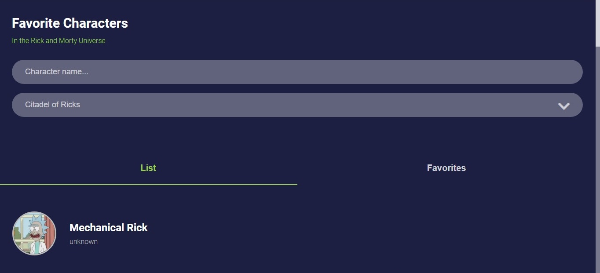

# Rick and Morty Challenge

This is the admision interview challenge from Patient Studio to see if the developer can use the respective technologies provided in the code sandbox, this was forked with a nice set-up already prepared before hand.

  
 

## Built With
- TypeScript
- GraphQL
- React.Js
- CSS

## Live Demo

[Live Demo Link](https://rick-and-morty-ceci.netlify.app/)

## Author
### Cecilia Benitez
- 👤 [GitHub](https://github.com/Ceci007)

## Show your support
Give a ⭐️ if you like this project

## Acknowledgments
- Inspiration
Appreciate the setup in the code sandbox provided by Patient Studio.
Appreciate the design in figma provided by Patient Studio.